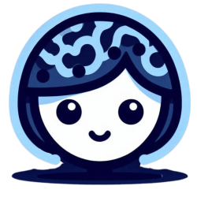
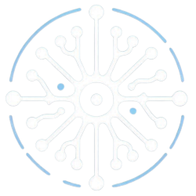

# 
🩺 **Diego Cesar Lerma Torres, MD**

  
  
  

  <h2>🌎 El mundo que nos rodea</h2>
  
Vivimos una época extraña, en la que la inteligencia artificial avanza aceleradamente, mientras que la salud humana permanece rezagada debido a la falta de inversión, voluntad, optimización de recursos y la implementación de tecnologías de vanguardia en el sector salud. Mientras los algoritmos de IA son capaces de modificar la arquitectura cerebral, atrapando a las personas en las redes sociales por más tiempo, los profesores en las aulas y los doctores en los consultorios carecen de las herramientas y recursos necesarios para abordar los problemas más críticos de la humanidad.

  

---

  <h2>💡 Mi Visión</h2>
  
Creo que el verdadero futuro de la humanidad no se encuentra en donde lo estamos buscando. Necesitamos tecnología para optimizar la educación y la salud humana y aplicar cada nuevo descubrimiento de IA en estas áreas, de forma segura y eficiente.
  
  En mi caso, quiero ser ese enlace entre estas tres partes: Salud, Tecnología y Educación, ayudando a crear los mecanismos para que la medicina de precisión sea la norma, y donde cada tratamiento y programa académico esté hecho a la medida.

  

---

  

  <cite style="font-size: 20px;"> Decía Jorge Ibargüengoitia "Escribo para leer un libro que no existe".

  Bueno... pues yo desarrollo software para ver soluciones que no existen. 

---

  <h2>🚀 Lo Que Estoy Construyendo</h2>
  <h3>LiaAI - IA con Empatía</h3>
  
Un sistema de inteligencia artificial que asiste al paciente en todos sus procesos de salud y facilita su relación y comunicación con el médico. La gente necesita entender que su salud es suya y los proveedores de servicios de salud solo somos un componente más de los muchos factores que pueden contribuir a mejorarla.

  
  
  <h3>Astrocyte - Optimización en Servicios de Salud</h3>
  
Un sistema de expediente clínico electrónico impulsado por IA, diseñado para hacer que los médicos puedan concentrarse en lo que realmente importa: brindar una atención de calidad, mientras la tecnología se encarga de las tareas repetitivas.

  
  
  <h3>Tutor-IA - Educación personalizada</h3>
  
Un asistente virtual para alumnos de educación básica, que apoya a los pequeños en obtener aprendizaje efectivo, personalizado, regularización continua y adquisición de valores fundamentales desde muy temprano.

  

  <h2>● Tecnologías ●</h2>
  <table>
    <tr>
      <th>🧠 Lenguajes</th>
    </tr>
    <tr>
      <td align="center">
        
        
        
        
        
        
      </td>
    </tr>
    <tr>
      <th>🧠 Librerías</th>
    </tr>
    <tr>
      <td align="center">
        
        
        
        
        
        
        
        
        
        
        
        
      </td>
    </tr>
    <tr>
      <th>📊 Otras herramientas</th>
    </tr>
    <tr>
      <td align="center">
        
        
        
        
        
        
      </td>
    </tr>
    </tr>
    <tr>
      <th>🩺 Habilidades Médicas</th>
    </tr>
    <tr>
      <td align="center">
        
        
                
        
        
        
        
      </td>
    </tr>
  </table>

---

  <h2>🌟 La verdadera IA</h2>
  
El conocimiento es un pilar de la humanidad. No busco una tecnología que reemplace al humano, sino que amplifique sus capacidades, estoy hablando del nuevo significado de las siglas IA: <strong>Inteligencia Aumentada.</strong>

  

  <h2>🌱 Mis Principios</h2>
  <h3>Hay algunas cosas que me rigen durante mi trayectoria de vida.</h3>

  <cite style="font-size: 20px">Primun no nocere (Lo primero es no dañar)</cite> 
Juré, al titularme como médico, que mi primer principio sería no dañar, ni aunque sea por un bien mayor. No se experimenta con la salud humana.

  <cite style="font-size: 20px">In dubiis, abstine (Ante la duda, abstente)</cite>
  
Si no existe evidencia suficiente como para aseverar que algo es seguro, es mala idea. El tratamiento médico es sagrado y no debe mancharse con suposiciones.

  
  <cite style="font-size: 20px">Medice, cūrā tē ipsum (Médico, cúrate a tí mismo)</cite>
Para curar a otras personas debemos curarnos a nosotros mismos primero. Por eso la salud y el autocuidado son cada vez más prioritarios en mi vida y mi rutina.

---

  <h2>☘️ Trayectoria</h2>
  
El aprendizaje es el medio, lo que hago con él es el fin. Les comparto algunas de las certificaciones más relevantes que he recibido.

  
  

---

  <h2>🔍 Mis bases</h2>
  <ul style="list-style-type:none;">
    <li><strong>Maestría en Inteligencia Artificial</strong> | Universidad Católica de Ávila, España | 2023 - 2025 (En curso)</li>
    <li><strong>Licenciatura en Desarrollo de Software</strong> | Instituto de Estudios Universitarios, México | 2019 - 2021</li>
    <li><strong>Licenciatura en Médico Cirujano</strong> | Universidad de Guanajuato, México | 2017 - 2023</li>
  </ul>

---

  <h2>🐈 Estadísticas de GitHub</h2>
  
Mi actividad en GitHub es un reflejo de mi compromiso con la innovación en la salud, donde cada proyecto es un paso hacia un futuro mejor.

  
  
  

---

  <h2>🌄 El Futuro que merecemos</h2>
  
La medicina y la tecnología no son metas, son caminos. Estoy aquí para explorar esos caminos, para hacer rutas para quien venga y para colaborar con quien quiera unirse a mí en esta búsqueda.

---

  <h2>🌐 ¡Cuenta conmigo!</h2>
  
Si compartes mi visión, por favor, no dudes en contactarme, al menos para saber que no estoy solo en esto. Estoy siempre abierto a nuevas ideas y proyectos.

  

---

  <h2>🍃 Date un respiro</h2>
  
Gracias por leer. Este espacio es un punto de paz y descanso en medio de toda la innovación. Siéntete cómoda de ver mis proyectos e inspirarte. Espero que encuentres algo que resuene contigo.

  

